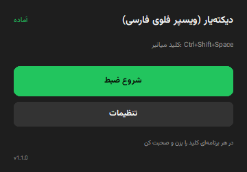
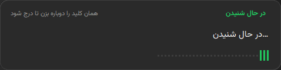
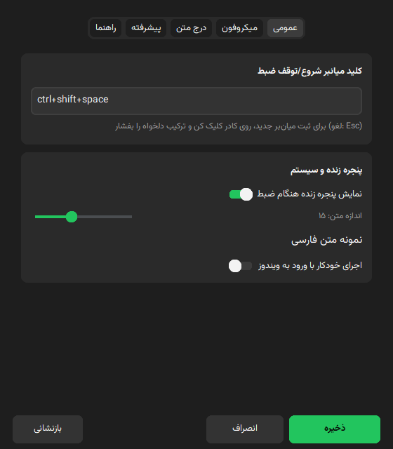
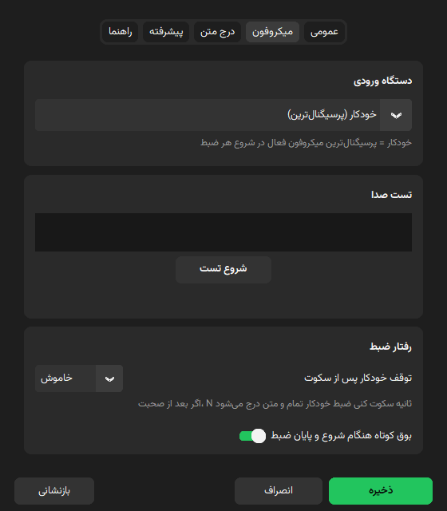
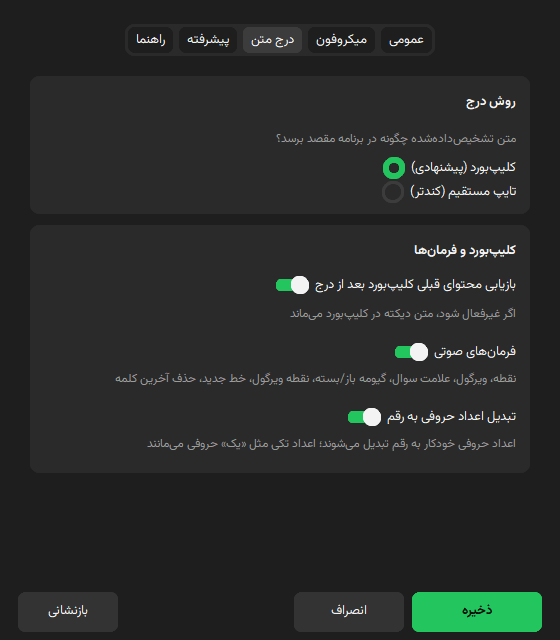
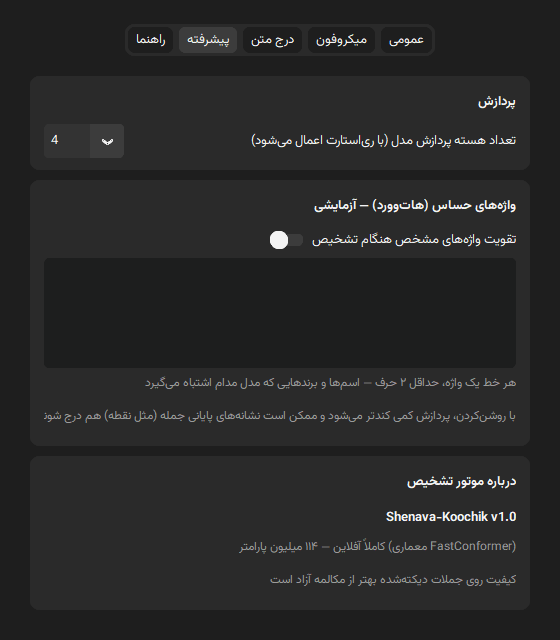
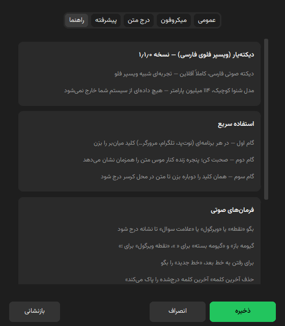

<div align="center">


[فارسی](README.md) | **English**

</div>

# DikteYar (دیکته‌یار)

Farsi (Persian) speech-to-text dictation, fully offline and local — triggered by a global hotkey from any app. A Wispr Flow–like experience, without a single byte of audio ever leaving your machine.

> 💚 **Special thanks to [Reza2kn](https://github.com/Reza2kn)**, creator of the [Shenava Koochik v1.0](https://huggingface.co/Reza2kn/Shenava-Koochik-v1.0) model that powers this app. This project simply would not exist without their open, high-quality model. If you find this app useful, please also star the model and the [Shenava-1 project](https://github.com/Reza2kn/shenava-1).

- **Model**: Shenava-Koochik v1.0 (FastConformer NeMo CTC, 114M parameters) via sherpa-onnx
- **Language**: Python 3.12 — CustomTkinter UI (no heavyweight GUI dependencies)
- **Platform**: Windows 10/11 **64-bit (x64)** — **this app is Windows-only** and does not run on Windows ARM (core modules are cross-platform, but the UI, text insertion and installer are built for Windows x64)
- **Version**: 1.1.0 — Windows installer (`DikteYar-Setup-1.1.0-x64.exe`) available under [Releases](https://github.com/nimaone/persian-whisper-flow/releases/latest)

## Features

- Changeable global hotkey + live text overlay window next to the mouse cursor
- Voice punctuation commands (period, comma, quotes, newline, delete last word)
- Auto-stop after silence (configurable: off/3/5/10 seconds)
- Short start/stop recording beeps
- Minimize to Windows system tray (Hidden Icons) + run at Windows startup
- Automatic active-microphone detection + live spectral mic test
- Text insertion via clipboard (with previous-content restore) or direct Unicode typing
- RTL Persian UI, dark Fluent theme, no white flash on launch

## Screenshots

| | |
|---|---|
|  |  |
| **Main window** — status and record toggle | **Live overlay** — text appears as you speak |
|  |  |
| **Settings — General** | **Settings — Microphone** (live spectrum test) |
|  |  |
| **Settings — Text insertion** | **Settings — Advanced** (hotwords) |
|  | |
| **Settings — Help** | |

## Install & Run

```bash
python -m venv .venv
.venv\Scripts\pip install -r requirements.txt
.venv\Scripts\python download_model.py   # fetch model.onnx + tokens.txt (see below)
.venv\Scripts\python app\main.py
```

### Getting the model (~438 MB)

The ASR model is not stored in this repository. Fetch it either way:

1. **Automatic (recommended)** — run `download_model.py` as shown above. It first tries this repo's GitHub Releases, then falls back to HuggingFace.
2. **Manual** — download `model.onnx` and `tokens.txt` from [HuggingFace: Reza2kn/Shenava-Koochik-v1.0-sherpa-onnx](https://huggingface.co/Reza2kn/Shenava-Koochik-v1.0-sherpa-onnx) and place them in the `model/` folder.

> Note for users in Iran: huggingface.co may be unreachable without a VPN/proxy; the script's GitHub Releases fallback (or a proxy) helps there.

## Usage

1. Run the app → tray icon appears (after ~3 s model load: "Ready")
2. In any app (Notepad, Telegram, browser…) press **Ctrl+Shift+Space** and speak
3. The live overlay next to your cursor shows the text being recognized
4. Press the hotkey again → text is inserted at the cursor
5. **Minimize** the main window → app stays in the tray (Hidden Icons); **double-click the tray icon** or use its "Show window" menu to bring it back

## Voice commands

| Say | Result |
|---|---|
| «نقطه» (dot) | . |
| «ویرگول» (comma) | ، |
| «علامت سوال» (question mark) | ؟ |
| «گیومه باز» / «گیومه بسته» | « / » |
| «نقطه ویرگول» (semicolon) | ؛ |
| «خط جدید» (new line) | Enter |
| «حذف آخرین کلمه» (delete last word) | Ctrl+Backspace |

Note: single words that also occur in normal speech (like «سوال») are never treated as commands, so regular sentences stay intact — say the full phrase «علامت سوال» for a question mark.

## Settings

Tray menu → "تنظیمات" (Settings). Five tabs (changes apply on "ذخیره"/Save; "بازنشانی"/Reset restores defaults):

- **General (عمومی)**: hotkey capture, start/stop beeps, live overlay + its font size, run at startup
- **Microphone (میکروفون)**: input device ("خودکار"/Auto = strongest-signal mic probed at recording start), live spectral test, auto-stop on silence
- **Text insertion (درج متن)**: insertion method (clipboard recommended / direct typing), clipboard restore, enable/disable voice commands, Persian ITN
- **Advanced (پیشرفته)**: model inference threads (applied after restart), engine about
- **Help (راهنما)**: app version, quick guide, voice commands, troubleshooting

## Project layout

```
model/              ASR model (model.onnx + tokens.txt) — downloaded, not committed
app/
  main.py           entry point — tray + hotkey + UI loop + silence auto-stop
  asr.py            sherpa-onnx engine + live/final transcription
  recorder.py       sounddevice capture + incremental 16kHz resample + mic detection
  overlay.py        frameless rounded live overlay (never steals focus)
  paster.py         insert at cursor: clipboard (backup/restore) or direct typing
  voice_commands.py Persian voice commands → punctuation/keys
  config.py         JSON settings in %APPDATA%\WhisperFlowFarsi + registry autostart
  theme.py          dark Fluent palette + icon loading
  win32.py          DWM dark/rounded windows, flashless show, min/max dialogs
  control_window.py main window (minimize → tray)
  settings_ui.py    five-tab settings + hotkey capture + mic test + help
  fonts.py          per-process Vazirmatn font registration (AddFontResourceEx)
assets/             logo (logo.png / logo.ico) + Vazirmatn font
spikes/             CLI test tools
```

## Technical notes

- The model is fully offline; the "live" view re-runs inference on the trailing 10-second window every 800 ms (CPU inference latency ≈ 0.04× audio length).
- **Incremental resampling**: each audio block is processed once; the partial only reads the trailing 10-second window — CPU cost is independent of recording length. Buffer is capped at 5 minutes.
- The hotkey is registered with `suppress`: the chosen combo is consumed by this app only.
- Mic auto-detection: all input devices are probed with a 0.35 s signal test and the strongest is picked.
- Clipboard insertion restores the previous clipboard content afterwards (~600 ms wait for slow apps like Electron).
- Windows get dark title bars and rounded corners via DWM and appear with alpha-fade (no white flash).
- Settings live in `%APPDATA%\WhisperFlowFarsi\settings.json`.
- **Persian ITN**: spoken numbers («بیست و سه», «سی‌وپنج») are converted to digits (۲۳, ۳۵) on insertion — toggleable in Settings. Small standalone numbers («یک», «هشت») intentionally stay as words.

## Limitations

- Insertion does not work into run-as-administrator apps (Windows limitation).
- Non-text clipboard content (image/file) cannot be restored — the dictation text stays on the clipboard.
- Quality is better on dictated sentences than free conversation.
- The recording buffer is capped at 5 minutes.

## Troubleshooting

- **Nothing is recognized** → run the mic "Test" in Settings; if no signal, try another device or keep "Auto".
- **Text is not inserted** → target app is run-as-administrator; run this app as admin too, or switch to direct typing.
- **Partial insertion** → slow target app; if clipboard mode fails, try direct typing.
- **Hotkey conflicts** → pick a new combo in Settings (e.g. Ctrl+Alt+D).

## Building the Windows exe (branch: feature/exe-installer)

```bash
.venv\Scripts\pip install pyinstaller
.venv\Scripts\python.exe -m PyInstaller dikteyar.spec --noconfirm
```

Output: `dist/DikteYar/` — a folder you can zip as a portable build. Notes:

- **onedir, not onefile** — instant startup; onefile extracts ~150 MB to temp on every launch and misbehaves with keyboard hooks and antivirus.
- **The model is not bundled** (light installer) — on first run a dialog offers an automatic download from GitHub Releases (~440 MB) or manual selection of a folder containing the files.
- `version_info.txt` provides the Windows version resource (name/version/icon in file Properties).
- For a full local test, copy `model/` next to `DikteYar.exe` to skip the first-run dialog.

### Installer (Inno Setup)

```bash
winget install JRSoftware.InnoSetup
"C:\Users\<you>\AppData\Local\Programs\Inno Setup 6\ISCC.exe" installer\dikteyar.iss
```

Output: `installer/Output/DikteYar-Setup-1.1.0-x64.exe` (~36 MB). Highlights: **per-user** install into `%LOCALAPPDATA%\Programs\DikteYar` (no admin required), optional desktop shortcut, run-at-startup checkbox, and the model is excluded from the payload so the installer stays light even if you copied it next to the exe for testing.

## License & Credits

- This app's code ("DikteYar"): **Apache-2.0** — see [LICENSE](LICENSE) (same family as the model's license)
- The "Shenava Koochik v1.0" model by Reza2kn: **Apache-2.0** — see [model/LICENSE](model/LICENSE)
  · [sherpa-onnx model repo](https://huggingface.co/Reza2kn/Shenava-Koochik-v1.0-sherpa-onnx) · [Shenava-1 project](https://github.com/Reza2kn/shenava-1)
- Full model details (architecture, training data, metrics): [model/README.md](model/README.md)
- Third-party attributions: [NOTICE](NOTICE)
